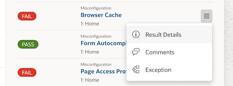
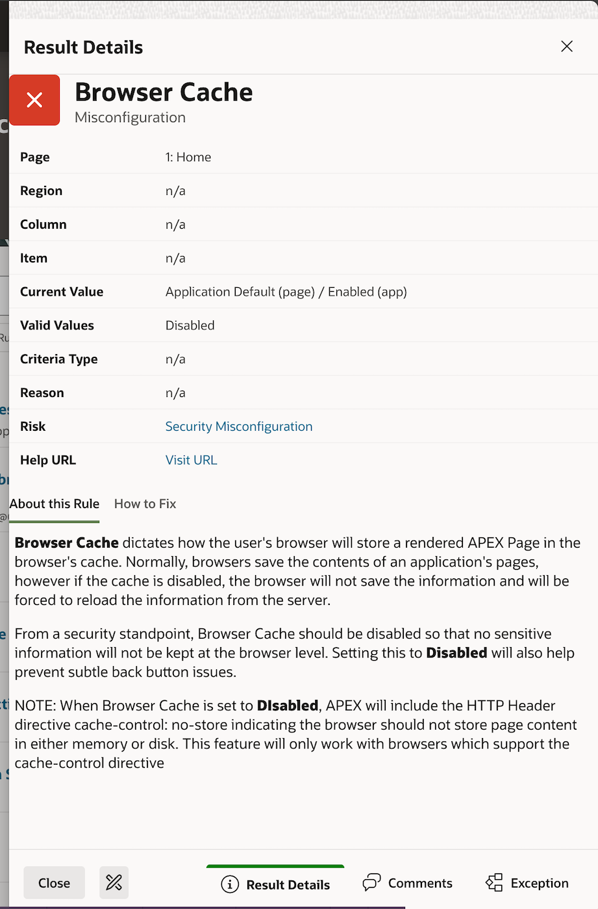
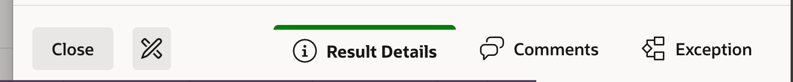
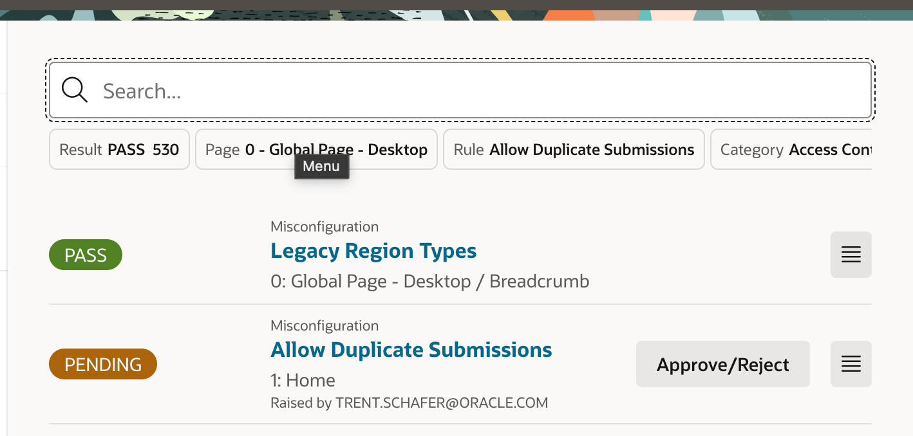
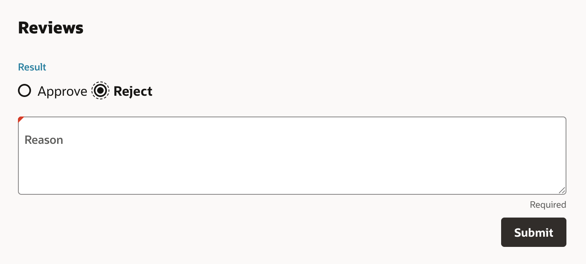
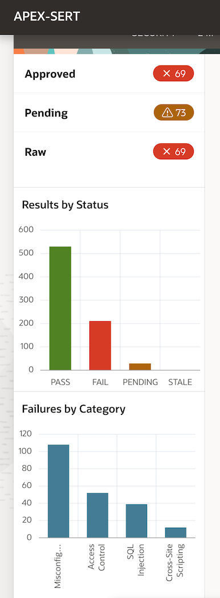
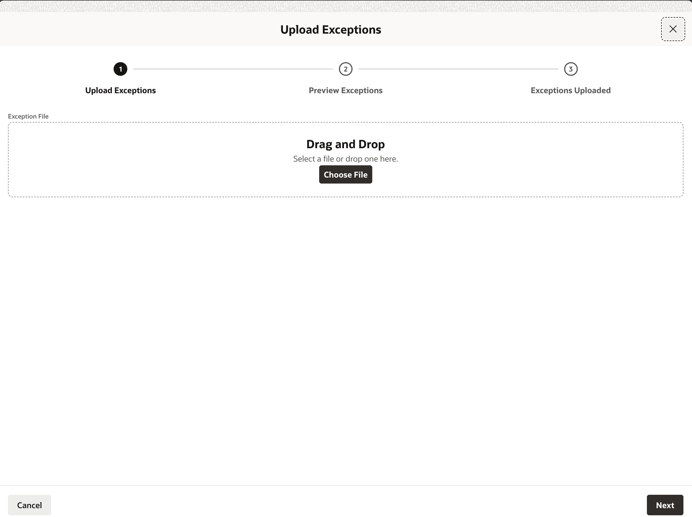
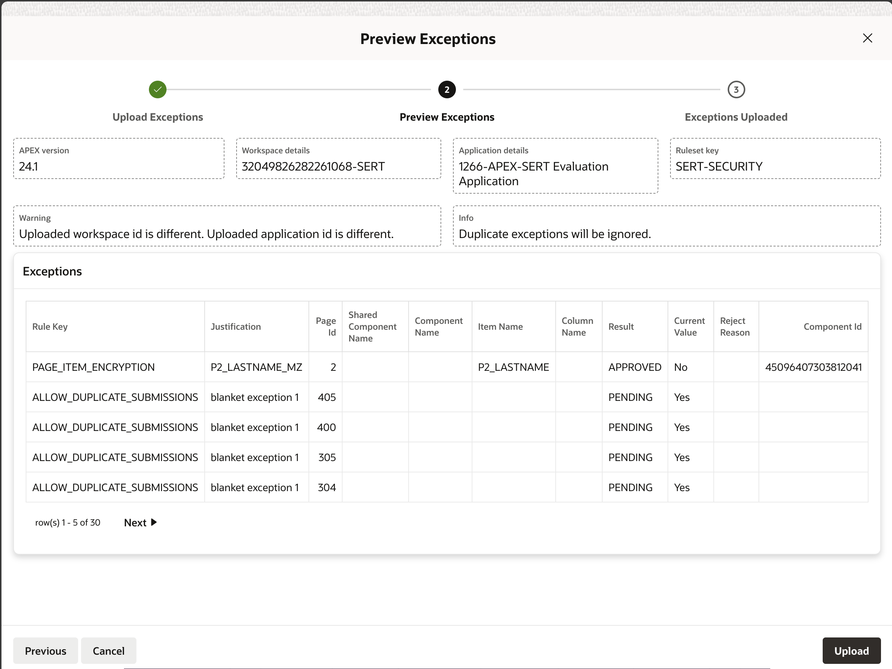
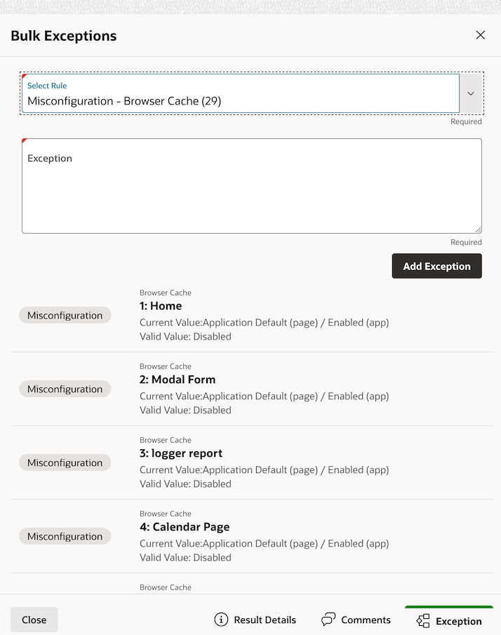

# APEX-SERT Administrator Guide

## 1. Overview

APEX-SERT is an APEX application that evaluates a selected APEX application for security vulnerabilities. The selected application will be evaluated on many topics including: Authentication, Authorization, SQL Injection, Cross Site Scripting (XSS), URL Tampering and many more. After an evaluation is complete, the user will receive a score for their application and a dashboard to review and modify any security vulnerabilities (issues). Each point of risk is described and a suggested action available to make correcting any security risks quick and easy. APEX-SERT also allows a user to provide exceptions to any issues that may not necessarily be vulnerabilities. A user with the Approver role can then approve or reject the exception based on the provided input and the score can then be reevaluated.

The APEX-SERT Admin Application is used to configure your instance of APEX-SERT, manage users and roles, and perform other administrative tasks. It is designed to be used by the DBAs or Security or System Administrators/Managers; access to this application should not be given out to all developers, nor is it required to perform the core functions of APEX-SERT. Upon installation of APEX-SERT, the APEX-SERT Admin application uses APEX builder Authentication, so developers in the SERT workspace can access the application via the builder.


For example: https://servername.com/apex/f?p=SERT_ADMIN

## TOC

[Home Page](#2-home-page)

## 2. Home Page

The APEX-SERT admnistration homepage is a simple landing page that highlights some basic statistics on your SERT installation.
It will show the number of Rulesets defined in your installation, the total number of rules that exist, and the total number of evaluations and exceptions in the system.

from the homepage you can use the hamburger/mega menu to navigate the application.


text

## 3. Setup

The Setup section of APEX-SERT Admin allows configuration of most parts of APEX_SERT.  in most cases, the only required areas to consider are some preference values, and the ability to purge stale versions.

### 3.1 Preferences

| Preference | Preference Key | Description | Sample Value |
|:---| :---: |  :---: | ---: |
| APEX Office Print Server URL  | AOP_URL         |Set this value if AOP was enabled at install | `https://myserver.com` |
| EMAIL FROM (sender)           | EMAIL_FROM      | email sender for automated emails via SERT | `noreply@myemail.com` |
|High Score Value               |HIGH_SCORE_VALUE | minimum score for a "green" result | `95`|
|Low Score Value                |LOW_SCORE_VALUE  | minimum score to avoid the red-zone |`70`|
|Log Evaluations                |LOG_EVALUATIONS  | log all checks in evaluations (debugging) |`N`|
|Log Imports                    |LOG_IMPORTS| Log Imports of Rules and exceptions|`Y`  |
|Sert Help URL |	SERT_HELP_URL| provide a URL to access Oracle Help |	https://docs.oracle.com/en/database/oracle/apex/ |
|AI Enabled| AI_ENABLED | enable AI functionality for SERT| N|Y|
|AI Static ID|AI_STATIC_ID| static ID for a defined generative AI service in your app/workspace| open_ai|
|AI Exception prompt|AI_EXCEPTION_PROMPT| a prompt to assess exception quality| (check your system for the default prompt)|

## 4. Rules
Rules are what APEX-SERT uses when evaluating an APEX application. each rule defines where and how APEX-SERT should look for a security vulnerability, and configures expected, valid values, Background on the finding and informatino on how to fix the finding

A rule is automatically stale if it relates to a version of APEX other than the currently installed version.

**Only** rules for the currently installed major version can be *active*.

It is possible to create custom rules for your own installation.

### Information

- **Rule Name:** descriptive name for the rule
- **Rule Key:** `UNIQUE_RULE_KEY`
- **Category:** Picklist of available categories
- **Risk:** OWASP top 10 risk
- **Impact:** area of APEX impacted by the rule
- **APEX Version:** major version of APEX this rule is created for
- **Time to Fix (hours):** *estimate*
- **Severity:** Low / Medium / High
- **Active:**  *switch*

### Rule Details

- **Rule Type:** APEX View / Custom Query
- **View Name:** selected view is rule type is APEX View
- **Custom Query** customised query if using Custom Query type. This has specific requirements for the select list, and should return one row per finding.
- **View Comments:**
  >description of the selected view
- **Column to Evaluate:** *single select LOV of available columns*
- **Component ID:** *column representing component_id*
- **Component/Additional Name:** *(not specified)*
- **Additional WHERE Clause:**  *restrict the query if needed*
  ```sql
   and page_id > 0
  ```
-

## 5. Jobs

text

## 6. Logs

text

# 000 remove below here


```sql
  SELECT COUNT(*) FROM users
  WHERE username = '&USERNAME.'
    AND password = '&PASSWORD.'
```


text


text


> [!TIP]
> Deleting an evaluation will also delete any associated Exceptions you have created.

### 3.1. Exception Statuses

The home page will display any Recent Evaluations that have been run and high-level metrics about exceptions. The simplified homepage shows the number of Exceptions that have been created, and required some action.
This includes exceptions that are:

* **Pending Approvals** - requested approvals that are pending the logged on user's approval or rejection.
* **Requested** - the logged on user's exceptions that have been requested for approval.
* **Stale** - Security is not an event, but rather a process. If an exception is put in place and then approved, and then the underlying value of that attribute is changed, is the exception still valid? Perhaps not. Therefore, APEX-SERT exceptions can go “stale” if the data for which they were approved changes. This process occurs automatically each time that an APEX-SERT evaluation is run.
* **Rejected** - Rejected exceptions. rejected exceptions must be withdrawn and resubmitted or deleted.

### 3.2. Recent Evaluations Table

The Recent Evaluations table displays the following information for each evaluation:

* **Score badge** - The Score is made up of a combination of the raw score plus any exceptions that have been both added and approved.
* **Rule Set** - The Rule Set used in the evaluation
* **ID** - The application ID.
* **Application** - The application name.
* **Evaluated** - How long ago the evaluation was last run.
* **User** - The user that ran the evaluation.
* **Exceptions** - Count of exceptions requiring some form of Action
* **Status badge** - Status of the Evaluation, this could be Completed,Stale, or Failed
* **Triangle icon** - Re-evaluate immediately
* **Clock icon** - Re-Evaluate in Background
* **Trash icon** - Delete the Scan

### 3.3. Evaluate Application

The vast majority of time spent in APEX-SERT will be spent browsing the results of an evaluation.

To evaluate an application complete the following steps:

1. Select **Application** to be evaluated
1. Select **Rule Set** to be used.
1. Select whether to execute Evaluation in background or foreground
1. Click Evaluate.

Rule Sets are specific to each version of APEX. It is part of APEX-SERT's design that you should run the Rule Set designed for the version of APEX on your database.  For example 24.1, or 24.2 as the case may be.

> [!WARNING] admin guide TBD

Reference the [Administration Guide](./samples.md) for more information

APEX-SERT will begin evaluating your application. Note: It may take anywhere from a couple of seconds to a minute or even longer, depending on the size of your application, size/complexity of the application being evaluated and processing power of your server.

## 4. Evaluation Dashboard

After running the evaluation, you are presented with the Evaluation Dashboard. When running an evaluation, the Application ID and Name being evaluated is displayed in bold type, as part of the breadcrumbs. As the application being evaluated changes, so will this title.


You have three Action buttons alongside the evaluation title
* Reports
  * Various reports for the evaluation
* Exceptions
  * Download Exceptions - Download all exceptions in JSON format
  * Upload Exceptions - uploade a JSON file of exceptions
  * Bulk Exceptions - process buulk Exceptions for a Rule
  * Bulk Approve/Reject Exceptions - Approve or reject Exceptions by Rule
* Evaluation
  * Re-Evaluate - re-evaluate immediately
  * Re-Evaluate in Background - run the evaluation in the background
  * Run Evaluation for Page - run the evaluation for a specific page
  * Schedule Evaluation - schedule an evaluation for a future time
  * Delete Evaluation - delete this evaluation


### 4.1. Rule Sets and Rules

APEX-SERT evaluates application accoridng to a rule set. Rule Sets are precisely as named, set of individual rules, and a rule set can comprise any combination or subset of rules.

Each rule is configured to search for and report on potential security vulnerabilities in an application. Some rules are simple in that they inspect a single component and look for a specific value, while others are more sophisticated and require a SQL query and function to determine if a threat exists. Some rules utilise  *Criteria* to raise findings. *Criteria* are individual tests that are grouped together as a *Criteria Type*, and a rule assigned a *Criteria Type* will test all grouped Criteria to evaluate a component.

As an end user of APEX-SERT, it is not important to understand how the attributes are computed as much as it is to understand how to interpret the results of the evaluation and take any corrective action if needed.

Each time an evaluation is run in APEX-SERT, it is done in conjunction with a rule set. A rule set is simply a list of rules that are grouped together. The APEX-SERT Security (<version.>) rule set includes all of APEX- SERT’s ~110 rules, and should be modified in any way. Additional rule sets can be created by a user with the Administrator role, and any number of rules can be included.

for example, Administrators can combine a subset of existing rules into a new rule set to focus of the most critical findings.

### 4.2. Categories

APEX-SERT evaluates Rules that can be divided into 4 Categories

1. Access Control
1. Cross-Site Scripting
1. Misconfiguration
1. SQL Injection

The Category of a rule is simply a broad classification of the area or Security that the rule is associated with.

Use the dashboard to filter by Category

### 4.3 Risks

 Each rule is further assigned a *Risk* from the [OWASP Top 10](https://owasp.org/Top10/).

 We assign OWASP risks to allow the developer to better (and more consistently) judge the criticality of the finding.

These risks are :
1. A01-2021 - Broken Access Control
1. A02-2021 - Cryptographic Failures
1. A03-2021 - Injection
1. A04-2021 - Insecure Design
1. A05-2021 - Security Misconfiguration
1. A06-2021 - Vulnerable and Outdated Components
1. A07-2021 - Identification and Authentication Failures
1. A08-2021 - Software and Data Integrity Failures
1. A09-2021 - Security Logging and Monitoring Failures
1. A10-2021 - Server-Side Request Forgery

### 4.3 Dashboard Smart Search

The Evaluation results report uses the Smart-search feature of APEX, with built-in chips for:
  * Result - Search by Result
  * Page - filter on a specific page
  * Rule - filter by Rule
  * Category - filter by category of finding
  * Raised by ( exception raised by)

click on the built-in chips to select a filter, or start typing and available filters will be presented for selection.

It's also possible to simply enter text for a text based search.

#### 4.3.1 Smart Actions
Each finding is listed in the smart search, and has a contextualy action menu on the right.
There are a number of actions available



1. Result Details - Show full details of the finding for a deeper examination, along with background information and guidance on fixing the finding
1.Comments - Enter comments on the finding for other reviewers or developers
1. Exception - create or view the exception for the finding

a sample of the result details is shown below



In this dialog you have all the information you need to determine your resolution to the finding.
The details drawer provides the Page,Region, COlumn, Item information as relevant, along with the current value of the component, the associated Risk, and a URL to APEX help documentation.
Two further tabs "About this Rule" and "How to fix" are provided to guide your next steps.

On the footer of the drawer are 5 actions to allow the user to process the finding.

1. Close - close the drawer
1. APEX builder icon - open the APEX builder to directly edit the component in question
1. Result details - show these details
1. Comments - show any comments created against this finding
1. Exception - show the exception on the finding, if any



##### 4.3.1.2 Create/Edit Exception

Once you have determined there is no *fix* for the finding, you can create an exception for it.
Any 2 developers in the workspace can create and approve an exception. the simple rule is: One cannot approve one's own exception. Any *other* developer can approve the exceptions your create.

Any developer can withdraw and exception. and for stale  exceptions, any developer can withdraw, or resubmit the exception without change.

##### 4.3.1.3 Approve/Reject Exceptions

from the dashboard, click on the Approve/Reject button to go directly to the required drawer for action


Then, either approve the exception, or reject the exception with an associated *reason*.



##### 4.3.1.4 Create/Edit Comment
COmments are intended to provide an ability to have some notes around a finding, as you work through resolving it.  This could revolve around possibilities for resolution, or draft exception reasoning.  Comments do not impact the flow of findings or exceptions

### 4.4. Sidebar

The left sidebar serves as a mini-dashboard within an Evaluation.

1. the first section on top shows the overall scores for the evaluation, with badges showing the percentage scored including Approved exceptions, then including Approved and Pending Exceptions, and finally the raw baseline score before any exceptions have been applied.
1. The second region shows a vertical chart of Results by status. Clicking on a status will add a filter to the smart search.
1. the final region is Failures by Category, helping users prioritise by type of finding.



#### 4.4.1. Section 1 Evaluation Scores


Beginning at the top of the left side-bar are the three scores for the evaluation:

* Approved
  - The approved score is made up of a combination of the raw score plus any exceptions that have been both added and approved.
* Pending
  - The pending score is made up of a combination of the raw score plus any exceptions that have been added but not yet approved.
* Raw
  - The raw score represents the actual results of the evaluation. Any attribute that returned a FAIL deducts one point from the total possible raw score.

When an evaluation is run, the three separate scores are generated. Each score is a percentage and represents the number of vulnerabilities detected, divided by the number of components evaluated. The more complex the application, the more components that will have to be evaluated. These scores are represented by the percentage of issues that have been identified and remedied by APEX-SERT.

As a first step, developers should examine the results and attempt to fix as many vulnerabilities as possible. When a group of vulnerabilities are fixed, the developer can re-evaluate the page or the entire application to update the scores.

At some point, all vulnerabilities that can be fixed will have been addressed. When this occurs, the score will still not be 100%. In fact, if you get a raw score of 100%, your application likely won’t run at all! To achieve a score of 100%, it will be necessary to create exceptions. An Exception is simply a reason as to why the developer feels that even though APEX-SERT flagged an attribute as failed, the risk is mitigated elsewhere. It can be as brief as a couple of words or as long as a few sentences.

Essentially, it should state why it is OK for a component to be configured the way that it is, despite it failing the evaluation.

For example, one of the attributes in APEX-SERT checks to ensure that all pages require authentication. However, if by design, there are several pages that are set to public, APEX-SERT will still fail those pages. Setting those pages to require authentication is not an option, as it would break the intended functionality of the application. In this case, the developer can create an exception and justify why it is OK that these pages failed the evaluation.

> [!TIP]
> Exceptions can be created in bulk - on a per rule basis to simplify such final sets of exceptions.

#### 4.4.2. Evaluation

The Evaluate button has a number of options

1. -> Re-Evaluate
This Action be available on the dashboard ithin the evaluation, and can be clicked after identified issues are fixed in the APEX application, or even to update the evaluation after a block of work has been completed/

1. -> Evaluate in Background
This action runs the full evaluation as an immediately submitted background job, freeing you up to continue working.

1. -> Run Evaluation for Page
Provides the option to just run all rules againsta single page in your application, making for a faster evaluation

1. Schedule Evaluation
Runa background evaluation at a time of your choosing

1. Delete Evaluation
Remove the evaluation and all it's exceptions

#### 4.4.3. Exceptions
The Exceptions actions button provides exception specific operations
1. -> Download Exceptions
1. -> Upload Exceptions
1. -> Bulk Exceptions
1. -> Bulk Approve/Reject Exceptions

#### 4.4.3.1. Download Exceptions

This is a feature for environments where an application being evaluated is transferred across different Database instances, and reduces re-work in re-justifying exceptions already raised. A lot of work will go into developers entering, approving and/or rejecting exceptions. As applications move from the development server to the QA server, it is important to be able to move the exceptions in tandem with the applications. Thus, APEX-SERT provides the ability for an administrator to import and export exceptions, similar to how APEX applications are imported and exported.

the `Download Exceptions` action will produce a JSON file containing all exceptions in the database, for the current evaluation

However, there are a some restrictions when importing and exporting exceptions

##### 4.4.3.2. Import/Upload Exceptions

Uploading exceptions in the UI is primarily designed to aid in transporting exceptions as an application is moved from one Environment to another.  In a carefully constructed set of environments, we may find that workspace ID and applicartion IDs are consistent in all environemnts, however, commonly, this is not the case, and workspace IDs or Application IDs change from Developer - QA - Production.
the Upload wizard will attemp to manage such situations, byt recognising Workspace and Application ID changes, and provide an opportunity for the developer to cofirm these during the uplaod.

from the home page, Select your desired evaluation by clicking on the `App ID: App Name link` in the evaluation report.

Now that you are in an active evaluation, you can use the Exceptions -> Upload Exceptions Action button menu to upload your JSON file of exceptions.
Importing exceptions is a 3 step process

1. Select a JSON file to upload via Drag and drop
  
2. Review the uploaded exceptions
  once uploaded, there are some rules that are applied:
    1. Source and destination workspace ID differs:  You will be notified on import of this difference, but if you choose, exceptions will be mapped to the destinations workspace
    1. Source and destination App ID differs:  you may not be able to keep the same ID.  You will be notified on import, and if you so choose, the upload will map the source App ID into the Destination App ID.
    1. Rule Set or version differs: NO import will be allowed
    1. Current value differs in Source and destination: This is a material difference in the value of the component: This makes the destination likely invalid, and import of the exceptions is blocked.  Re-import a current copy of your application and rescan to ensure finding values match.
    
3. Upload the exceptions
  the previewed exceptions will be attemped for uplaod.  NOTE: duplicate exceptions will be ignored, not updated.

At this point, imported exceptions are visible from APEX-SERT just like those entered into the application natively.

##### 4.4.3.3. Bulk Exceptions
APEX-SERT also allows the developer to raise bulk exceptions.  Exceptions can be raised individually, or for all Failures on a specific rule.

First, select the `Rule` you wish to create bulk exceptions against.  The list of selectable rules shall have the number of findings, eg:  `Misconfiguration - Browser Cache (29)`
once a rule is selected you will be presented with a mini-report of the findings for review.

Simply provide your justification as you would for any exception, and this is applied to all findings for the rule



##### 4.4.4 Reports

Depending on what has been enabled in your application, you will have access to:
1. AOP based reports
1. DocGen Reports
1. Interactive reports for built-in APEX functionality

AOP and DocGen report pages are only available and usable if  a) the system was installed with the options enabled, and b) the AOP server and DOcGen print server are correctly configured

### 5.1. Menu

### 5.2. APEX-SERT

Selecting APEX-SERT will return the user to the APEX-SERT Home page.

### 5.3. Logged in User
The available options that display under the logged in user are:
* About

  Displays the License text for the application

* Close Window

  Selecting Sign Out will log you out of the APEX-SERT application.
