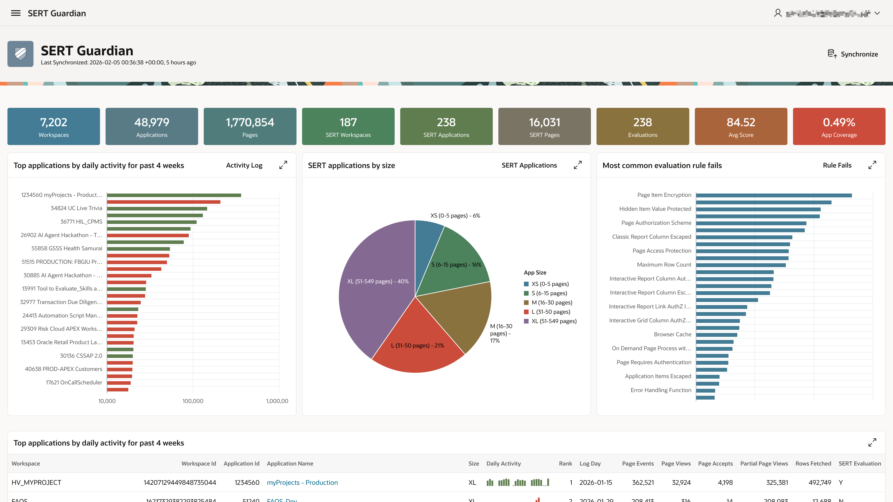

# SERT Guardian



**SERT Guardian** provides a holistic view of **SERT APEX** application security at the instance level.

Designed for both security specialists and technical leads, it transforms complex instance-level data into actionable intelligence.

From a single centralized dashboard, you can track vital health signals across your entire ecosystem - from compliance scores and rule failure patterns to application complexity and sizing metrics. Our intuitive faceted search and deep-dive detail pages eliminate the noise, allowing you to pinpoint vulnerabilities with surgical precision.

By bridging the gap between APEX Activity Logs and security auditing, SERT Guardian empowers your team to prioritize the applications that matter most. Whether you are performing manual oversight or building a foundation for automated security orchestration, SERT Guardian ensures your defenses always keep pace with your development.

#### Key Capabilities:

**Instance-Wide Observability**: Monitor compliance scores, rule failure patterns, and coverage levels across all workspace applications from a single source of truth.

**Risk Profiling**: Evaluate application risk by correlating "activity" and "complexity" metrics with SERT security audit results.

**Targeted Forensics**: Utilize faceted search pages to isolate vulnerabilities and access granular detail pages for specific SERT rule violations.

**Strategic Prioritization**: Leverage integration with APEX Activity Logs to identify high-traffic or high-exposure applications, ensuring audit resources are directed toward the highest-risk assets.

## Installation Guide

SERT Guardian is a module within the APEX-SERT installation script. Install by carrying out the following steps:

1. Enable the SERT Guardian installation by editing the properties in `sert.properties`
2. Run (or re-run) the installation script `install.sql`.

### Enable the SERT Guardian installation

Edit the `sert.properties` file, changing the SERT Guardian Properties section to enable the installation, assign the application_id and the authentication scheme.

```bash
# ======================================================================
# SERT Guardian Properties
# ======================================================================

# Conditional context to install guardian
# Must be set to "runtime" to install guardian or "none"
# e.g.
# guardian_switch = runtime
guardian_switch = runtime

# Set sert_guardian_app_id to empty value to auto-allocate Application ID
# e.g.
# sert_guardian_app_id =
# sert_guardian_app_id = 38223
sert_guardian_app_id = 2102

# Set the Authentication Scheme from the included options:
#   "Builder Extension Sign-In" - enables you to integrate this application with the APEX development environment.
#   "SAML Sign-In"              - supports authentication with SAML2 identity providers
#   "Oracle APEX Accounts"      - internal user accounts that are managed in the Oracle APEX user repository.
# e.g.
# guardian_authn_scheme = Builder Extension Sign-In
guardian_authn_scheme = Builder Extension Sign-In
```

### Run the installation script

This script must be run as the installing schema ( we will reference ACDC), and only takes a few minutes to complete if you are executing the installation locally to the database. It must be run using SQLCL as we rely on liquibase built-in commands in SQLCL 24.2 and higher.

From the root directory of the APEX-SERT installation source:

1. Enter the following command and press enter:

    `sql ACDC@[database]`

    you will be prompted for your schema password, and [database] is your database TNSNames entry. For ADB, use the LOW connection to avoid parallelisation
1. Depending on your environment, it may not be necessary to enter a value for `[database]`.
1. From the prompt, enter the following and press enter:

    `@install.sql`

## Post Installation Steps

You may want **create a scheduled job** to automatically synchronize the SERT evaluation data, and the APEX daily activity data into SERT Guardian.

Schedule this job after the `ORACLE_APEX_DAILY_MAINTENANCE` job completes (1 a.m. default start) to ensure all daily activity metrics have been successfully aggregated.

```sql
begin
    dbms_scheduler.create_job(
        job_name            => 'sg_daily_etl_job',
        job_type            => 'stored_procedure',
        job_action          => 'sg_util.run_main_etl',
        start_date          => systimestamp,
        repeat_interval     => 'freq=daily; byhour=2; byminute=0; bysecond=0',
        enabled             => true,
        comments            => 'Daily execution of the main ETL process for SERT Guardian.' );
end;
/
```

## Uninstallation Guide

To remove SERT Guardian, run the uninstall script to remove the APEX application, database objects, and changelog entries.

> [!TIP]
> If you created a scheduled job to synchronize SERT Guardian automatically, you will need to drop this job also.

From the root directory of the APEX-SERT installation, login as the user that installed APEX-SERT and run `product/guardian/uninstall/uninstall_guardian.sql`:

```sql
SQL> @product/guardian/uninstall/uninstall_guardian.sql
------------------------------------
Uninstalling SERT Guardian
------------------------------------
Removed SERT Guardian APEX application
Dropping packages
....SG_UTIL
....SG_ETL_TASK
....SG_ETL_CONTROLLER
Dropping views
....SG_LAST_COMPLETED_MAIN_ETL_V
....SG_ETL_EXECUTION_TASKS_LOG_V
....SG_ETL_EXECUTION_LOG_V
Dropping tables
....SG_MOST_4WK_APP_ACTIVITY_F
....SG_INSTANCE_METRICS_F
....SG_DAILY_APP_ACTIVITY_F
....SG_APP_RULE_FAILS_F
....SG_AGG_APP_RULE_RESULTS_F
....SG_RULES_D
....SG_RESULTS_D
....SG_APPLICATION_PAGES_D
....SG_APPLICATIONS_D
....SG_ETL_TASK_LOG
....SG_ETL_TASKS
....SG_ETL_EXECUTION_LOG
....SG_ETL_PIPELINE_PARAMETERS
....SG_ETL_PIPELINES
....SG_ETL_CONTROLLER_LOCK
....SG_APP_RULE_FAILS_FS
....SG_AGG_APP_RULE_RESULTS_FS
Dropping types
....SG_PARAMETERS
....SG_PARAMETER
Removing changelog entries
....deleted 70 changlog entries for "product/guardian"
------------------------------------
Verifying no Guardian objects exist:
....no obects detected.
------------------------------------
```

### Additional Resources

- [SERT Guardian Star Schema Design](sert-guardian-star-schema.md)
- [SERT Guardian ETL Controller](etl-requirements.md)