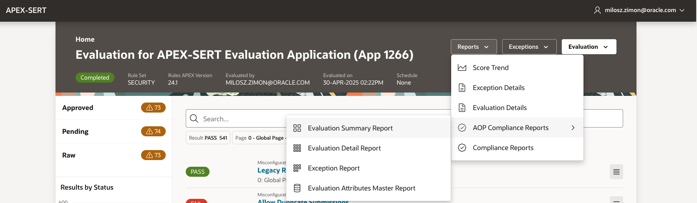

# Guide to APEX Office Print (AOP) enabling within APEX-SERT

The following document describes steps to enable AOP functionality within an Open-Source release of APEX-SERT.
APEX-SERT Open-Source version contains a number of Compliance reports developed specifically for AOP.
These ship with the product but have been disabled, pending installation of the AOP framework database objects, excluded from the distribution due to the Open-Source licensing implications.

When installation of the AOP framework database objects is completed, user needs to configure access to available AOP server instance and subsequently enable AOP reports within the APEX-SERT installation.

## AOP installation steps

AOP information can be found at United Codes [Apex Office Print](https://www.apexofficeprint.com/).


<br>

Source AOP database objects from United Codes [AOP Login](https://www.apexofficeprint.com/ords/uc/r/aop_portal/login_desktop/).<br>
You must create an account and login before you can download installation files.


<br>

Download and install AOP distribution [AOP Downloads](https://www.apexofficeprint.com/ords/r/uc/aop_portal/downloads/).


<br>

AOP objects must be installed into the SERT_CORE database schema.
Ensure that, at the end of this process, all AOP object successfully compile.

At a minimum, these AOP database objects must be created:

### Tables

AOP_CONFIG<br>
AOP_DOWNSUBSCR_TEMPLATE<br>
AOP_DOWNSUBSCR_TEMPLATE_APP<br>
AOP_DOWNSUBSCR<br>
AOP_DOWNSUBSCR_ITEM<br>
AOP_DOWNSUBSCR_LOG<br>
AOP_DOWNSUBSCR_OUTPUT<br>
AOP_DOWNSUBSCR_MESSAGE<br>

### Triggers

aop_config_biu<br>
aop_downsubscr_template_biu<br>
aop_downsubscr_template_app_bi<br>
aop_downsubscr_biu<br>
aop_downsubscr_item_biu<br>
aop_downsubscr_log_biu<br>
aop_downsubscr_output_biu<br>
aop_downsubscr_message_biu<br>

### Views

OUTPUTTO_COLLECTION

### Packages

aop_api22_pkg<br>
aop_convert22_pkg<br>
aop_modal_api_pkg<br>
aop_modal_pkg<br>
aop_plsql22_pkg<br>

### Procedures

aop_outputto_email

Within APEX-SERT installer locate and execute these scripts:<br>
@product/aop/grants/aop_setup.sql

## AOP server configuration steps

Before running AOP reports, you need to ensure that you have access to an AOP server.

Using your AOP server URL, update APEX-SERT integrated preference system table using this command:

```sql
update sert_core.prefs
set pref_value = 'YOUR AOP SERVER URL'
where pref_key = 'AOP_URL';

commit;
```

## AOP reports enable

In APEX-SERT Shared Components, locate the AOP build option and set it to Include.


## AOP reports run

AOP reports are available from the AOP Compliance Reports via the Reports button in the Evaluation Details Dashboard.
These can be accessed after application evaluation completes successfully.



Finally note that APEX-SERT AOP reports output is distributed via password protected PDF files.
After report output is downloaded, its corresponding password is displayed on a page.<br>
In addition, it is delivered to your APEX username defined email address, provided you successfully configured Email server in your APEX workspace Instance Settings.
