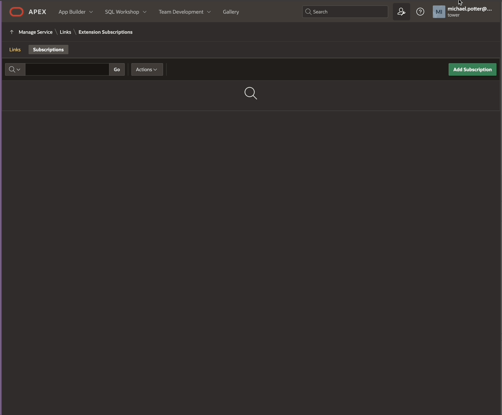
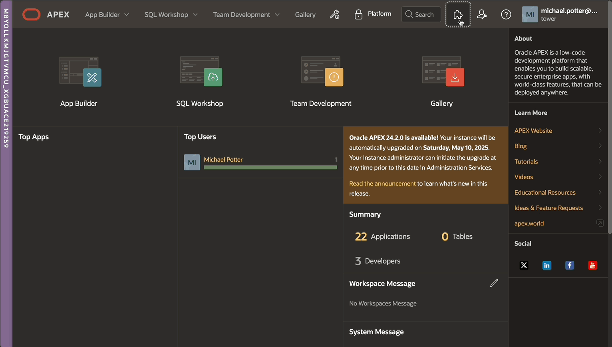

# APEX-SERT 24.1 Installation Guide

## PREFACE

## 1.1 Audience

The APEX SERT Installation Guide is provided as a reference to install APEX-SERT. It is intended for system administrators and/or DBAs. You will require access to the SYS database account and APEX Internal workspace credentials in order to install APEX-SERT.

## 1.2. Conventions

The following typeset conventions are used throughout this document:

Plain Text
Plain text is nothing more than standard, narrative text. No special actions are required.

`Fixed Width`
`Fixed width`  is used to denote input required from the user. When something is in the fixed width font, that text should be entered into the corresponding field or region.

**Bold** is used to indicate that you should perform an action, such as clicking a link or pressing a
button, which corresponds to the value of the Bold text.

**<ins>Bold Underline</ins>** is used to refer to a label or section of a page. Bold Underline labels will typically denote where an action should occur, not the action itself.

## INSTALLATION

Installing APEX-SERT is a simple process that is done entirely via a SQL script. The script will not only install the required database objects, but also create the APEX-SERT workspace and install the APEX-SERT applications. There is only a single manual step that is required to complete the installation.

### 2.1. Requirements

#### 2.1.1. Software Versions

#### 2.1.1.1 APEX

Minimum APEX version: 24.1

APEX-SERT 24.1  is supported only on Oracle APEX 24.1 and higher. If you are using an APEX version prior to 24.1, you need to upgrade your instance to use SERT.

> [!NOTE]
>This version of APEX-SERT is a complete rewrite from the ground up. It can be installed independently of an existing SERT, but there is no migration of historical scans, nor of exceptions.

#### 2.1.1.2 Requirements for AOP

to use the AOP report pages, you MUST have your own APEX Office Print Server. 

links: Einstein Get started using APEX Office Print today!

#### 2.1.1.2 Requirements for DocGen

APEX-SERT provides the capability to make use of DocGen, provided you have already setup and configured DocGen for your service.

APEX-SERT does not install or configure DocGen.  you must seperately configure your instance use DocGen.

some links:

* [Document Generator Function](https://docs.oracle.com/en-us/iaas/Content/Functions/Tasks/functions_pbf_catalog_document_generator.htm)

* [kris Rice: PDF Generation with OCI Pre-Built Function](https://www.linkedin.com/pulse/pdf-generation-oci-pre-built-function-kris-rice-gbree/)

Oracle internal only:

* [https://gbuconfluence.oraclecorp.com/display/CDSTS/How+to+configure+APEX+to+use+DocGen+as+a+print+server](https://gbuconfluence.oraclecorp.com/display/CDSTS/How+to+configure+APEX+to+use+DocGen+as+a+print+server)

* [https://gbuconfluence.oraclecorp.com/display/CDSTS/Integrating+OCI+Document+Generator+Function](https://gbuconfluence.oraclecorp.com/display/CDSTS/Integrating+OCI+Document+Generator+Function)

once you have a working DocGen service, you can set preferences in the APEX-SERT administration application by navigating to Setup → Preferences and providing the required data values.

#### 2.1.2. Resources

In order to install APEX-SERT, you will need access to the following system resources:

* Oracle SYS or ADMIN database account.
  - SYS is used ONLY in non ADB installs, to create a privileged installer schema
* For Autonomous installs, use ADMIN
* Oracle APEX instance administration account
* SQLCL  24.2 or higher

If you do not have access to all of the above, then it is not possible to install APEX-SERT. Please consult with your local system administrators and/or DBAs for assistance. 

#### 2.1.3. Tablespaces

While not necessary, many DBAs prefer to put vendor products in their own tablespace. If you decide to do this, you must create the new tablespace before installing APEX-SERT.

APEX-SERT requires at least 50MB of tablespace, and could require more, depending on how many attribute and attribute sets you create.

For AUTONOMOUS, use DATA as your tablespace

#### 2.2 Downloading

#### 2.2.1 ACDC installing schema creation script

Access the "acdc" setup scripts from the sert_latest.zip file, located in product/sert/pre-install/.  refer to the [README.md](README.md) for details of installation

As the `ADMIN` or `SYS` user, use the supplied script create_acdc_schema.sql using sqlcl.

you MUST use this schema (or some adequately privileged schema you already have) in non autonomous environments, liquibase will not run as SYS.  Currently we observe that ADMIN can be used successfully in ADB.

for AUTONOMOUS databases, user the LOW service.  use of other services like HIGH, will use parallelisation, which causes liquibase to fail with an ora-12838 error.

```sql
-- from product/sert/pre-install
-- directory
-- you can specify any name for your installing schema, we use 'ACDC'.
SQL> @create_acdc_schema.sql ACDC <password> <tablespace-name>

-- for ADB
SQL> @create_acdc_schema.sql ACDC <password> DATA
```

Now, you have a validly configured account that can install APEX-SERT

#### 2.3. Installation

APEX-SERT installs via a single installation script. This script must be run as the installing schema ( we will reference ACDC), and only takes a few minutes to complete if you are executing the installation locally to the database. 

Prior to installation, EDIT the sert.properties file to define your configuration.

If you wish to pre-specify the Application ID for the SERT application, and it's companion Administration application, then put a valid, available application ID against sert_app_id and sert_admin_id

Define your desired AOP server:  You can simply define as localhost if you do not have or intend to use AOP.

```sh
########################################################################
# SERT Properties File
########################################################################
# using SERT is strongly recommended as a workspace name
sert_apex_workspace = sert
sert_admin_user = sert_admin
# leave the next two ID's blank to automatically allocate an application ID
sert_app_id = 2000
sert_admin_id = 2001
# define YOUR AOP hostname
# uncomment if you are using AOP, and provide the URL to AOP printserver
sert_aop_url = https://localhost:8010
# set an administrator email
sert_admin_email_address = you@me.com
sert_email_from = noreply@me.com
# don't change sert_mode unless you know what it will do to you
sert_mode = standalone

##############################################
# if you leave the tablespace properties BLANK, installer will attempt to identify default tablespaces
# this is fine for ADB and some PDBs that are well configured, but for deployment one should
# explicitly define the tablespaces you install into. This only have effect on first install
sert_data_tablespace =
sert_temp_tablespace =
```

The installation will create two schema in your database:

* **SERT_CORE**
  - Schema which holds all of the APEX-SERT database objects and metadata.
* **SERT_PUB**
  - Schema which will be used as the Parse As schema for the APEX-SERT APEX applications.

It also creates an APEX workspace called SERT (or the name you supplied in the sert.properties). This is where the APEX-SERT APEX applications will be installed. The SERT workspace will not contain any developer users or workspace administrators, as it is not necessary nor required that any APEX developer access this workspace.

##### To install SERT: 

> [!IMPORTANT] for AUTONOMOUS databases, user the LOW service.  use of other services like HIGH, will use parallelisation, which causes liquibase to fail with ora-12838 error.
>
> you MUST use SQLCL, as we rely on liquibase and liquibase must be used via the built-in commands in SQLCL 24.2 and higher
>
> The APEX-SERT scripts must be installed from sql at the command line, as they use very specific commands only available via sqlcl. These scripts will not run correctly via sqlplus, SQL Developer or any other GUI environment.

1. Locate and change directories to the sert_latest directory that was created in the last section.
1. Enter the following command and press enter:

    `sql ACDC@<database>`

    you will be prompted for your schema password, and <database> is your database TNSNames entry. For ADB, use the LOW connection to avoid parallelisation
1. Depending on your environment, it may not be necessary to enter a value for `<database>`.
1. From the SQL Plus prompt, enter the following and press enter:

    `@install.sql`

## 3. POST-INSTALLATION

### 3.1 Publish the extension to all current workspaces

The design of the builder extension menu means that we *cannot* have the extension automatically available to all workspaces. Each workspace must **subscribe** to the SERT extension link.  Luckily, we have code that will find and enable all workspaces that do not have the link.

This should be run as the "acdc" or equivalent user.  (admin should work too in ADB)

```sql
BEGIN
    for rec in
      (select workspace from apex_workspaces aw
        where aw.workspace <> 'SERT'
        and   not exists ( select workspace_name from apex_workspace_schemas ws
                            where ws.workspace_name = aw.workspace and schema = apex_application.g_flow_schema_owner)
        minus
        select grantor_workspace workspace
        from apex_workspace_extension_grant
        where grantee_workspace = 'SERT' )
    loop
          apex_instance_admin.grant_extension_workspace(
              p_from_workspace      => rec.workspace,
              p_to_workspace        => 'SERT',
              p_read_access         => true
          );
    end loop;
end;
/
```

### 3.2. Manually subscribe a workspace

to do this manually for a single workspace:

1. Click the Administration Icon
1. select Manage service , then Manage Extension links
1. Click on the Subscriptions tab link
1. Click on the Add Subscription button
1. set Extension Workspace to SERT
1. turn on the "Has Read Access" Toggle
1. Click Subscribe



### 3.3 Launch SERT

1. Click the "Extensions" icon to the left of the Administration icon
1. select SERT then Evaluations

    <!--  -->


